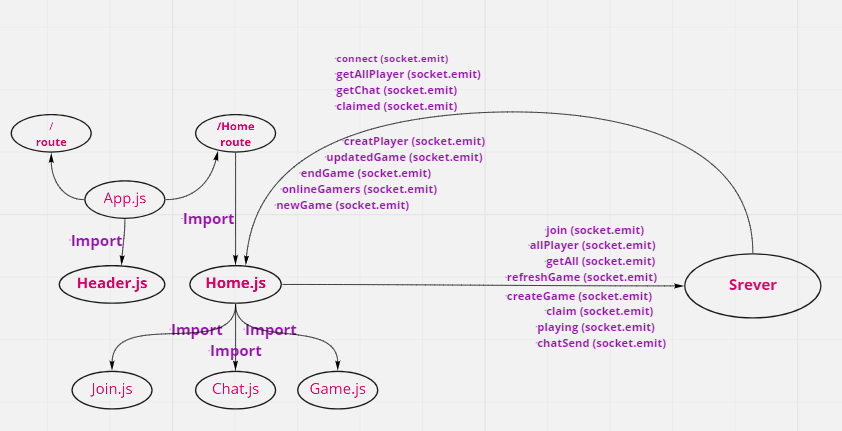

# Getting Started with realtime-tic-tac-toe-game :

## realtime-tic-tac-toe-game :

  * realtime-tic-tac-toe-game : for two players, X and O, who take turns marking the spaces in a 3×3 grid. The player who succeeds in placing three of their marks in a diagonal, horizontal, or vertical row is the winner.

   

### Visit Our Website :

  [tic-tac-toe-game-frontEnd](https://tictactoe401.netlify.app/)

  [tic-tac-toe-game-backEnd](https://xogame401.herokuapp.com/test)

### Team Members:

  1. Hiba Salem
  2. Sukina Abu-Hammad

### Setup :
  #### Getting Started :
     * clone the Repo
     * Install the dependencies
     * Write the code.
     * Running The App.
     * Start Playing X or O game (tic-tac-game)
  
  #### .env requirements :
     * PORT 
     * SERVER_URL
     * DATABASE_URL

  #### Running The App :
     * npm start
     * nodemon

### UML :

  

